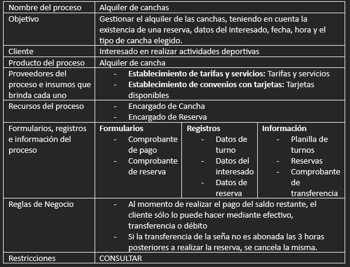
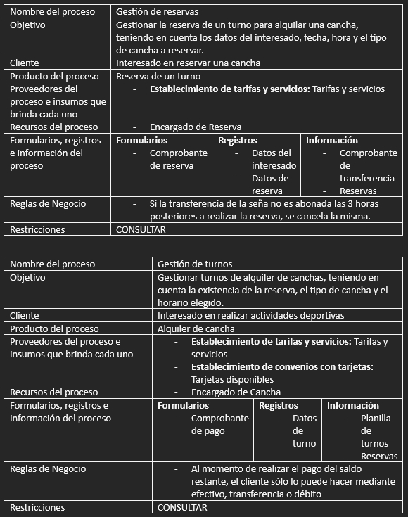
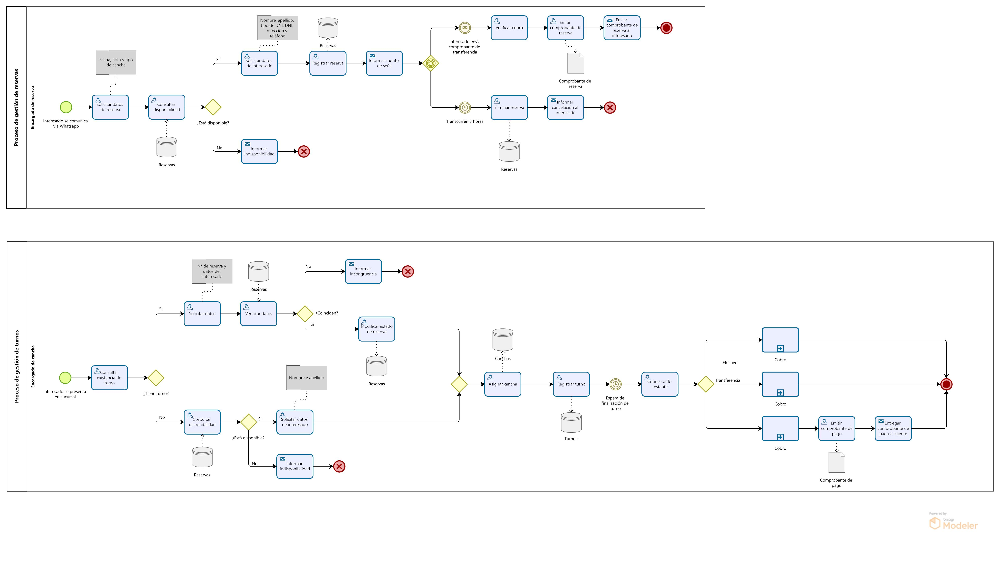

# Mapa de procesos (1)

## Procesos estratégicos
- **Establecimiento de convenios con tarjetas:** Establecer las tarjetas aceptadas para realizar los pagos de cancha.
- **Establecimiento de tarifas y servicios:** Establecer los servicios que ofrece la organización, así como los valores de los mismos.
- **Establecimiento de marcos de calidad(canchas):** Establecer marcos de calidad óptimos para las instalaciones deportivas, considerando la cantidad de horas de uso.

## Procesos centrales
- **Alquiler de canchas:** Gestionar el alquiler de las canchas, teniendo en cuenta la existencia de una reserva, datos del interesado, fecha, hora y el tipo de cancha elegido.

## Procesos de soporte
- **Mantenimiento de canchas:** Brindar mantenimiento a las canchas para su próxima utilización, teniendo en cuenta los marcos de calidad establecidos.
- **Compra de material:** Adquirir los insumos necesarios mediante los proveedores elegidos para la realización de los demás procesos.

# Mapa de procesos (2)

## Procesos estratégicos
- **Establecimiento de convenios con tarjetas:** Establecer las tarjetas aceptadas para realizar los pagos de cancha.
- **Establecimiento de tarifas y servicios:** Establecer los servicios que ofrece la organización, así como los valores de los mismos.
- **Establecimiento de marcos de calidad(canchas):** Establecer marcos de calidad óptimos para las instalaciones deportivas, considerando la cantidad de horas de uso.

## Procesos centrales
- **Gestión de reservas:** Gestionar la reserva de un turno para alquilar una cancha, teniendo en cuenta los datos del interesado, fecha, hora y el tipo de cancha a reservar.
- **Gestión de turnos:** Gestionar turnos de alquiler de canchas, teniendo en cuenta la existencia de la reserva, el tipo de cancha y el horario elegido.

## Procesos de soporte
- **Mantenimiento de canchas:** Brindar mantenimiento a las canchas para su próxima utilización, teniendo en cuenta los marcos de calidad establecidos.
- **Compra de insumos:** Adquirir los insumos necesarios mediante los proveedores elegidos para la realización de los demás procesos.

# Plantilla de proceso (1)

# Plantilla de proceso (2)

# BPMN (1)
Faltante.

# BPMN (2)

