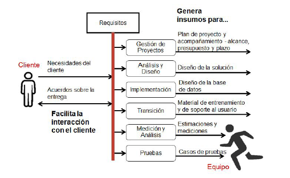
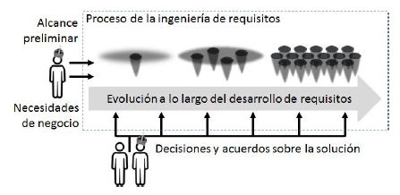
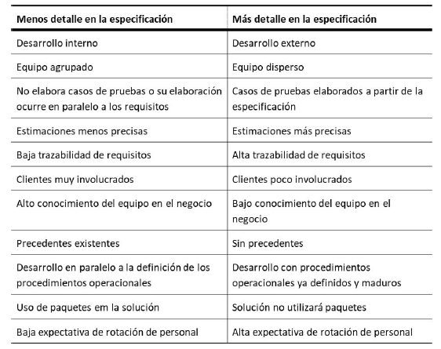

# Ingeniería de requisitos
Disciplina de la ingeniería de software que consiste en el uso sistemático y reiterado de técnicas para cubrir las actividades de adquisición, documentación y mantenimiento de un conjunto de requisitos para el software que cumplan con los objetivos del negocio y que sean de calidad.

## ¿Cómo se relaciona con el término "Ingeniería"?
La ingeniería de requisitos está estrechamente vinculada a la adquisición y aplicación del conocimiento para la creación, desarrollo e implementación de sistemas de información.

> Uno de los principales beneficios es permitir la comprensión continua de las necesidades del cliente para entregar una solución que cumpla con los objetivos del negocio, que son dinámicos y cambiantes.

## Proceso general de Ingeniería
> Pregunte -> Imagine -> Planifique -> Cree -> Mejore

## Contexto u Entorno de la Ingeniería de requisitos

**Análisis y Diseño:** Preparación del diseño de la solución.
**Implementación:** Diseño de la base de datos.
**Gestión de Proyectos:** Planificación de proyectos y seguimiento al alcance, presupuesto y plazos.
**Transición:** Producción de material de formación y apoyo al usuario.
**Medición y Análisis:** Producción de estimaciones y mediciones.
**Pruebas:** Documentación de casos de prueba.

Desarrollo de requisitos (RD - Requeriments Development)

Gestión de requisitos (REQM - Requirements Management)

# Requisito
> Requisitos $\neq$ Documentación
> *La calidad es el cumplimiento de requisitos*

- El requisito está relacionado con las necesidades. **Necesidad**
    - Requisito es una condición o capacidad necesaria del usuario con el fin de resolver un problema o alcanzar un objetivo.
- El término requisito también se aplica en el contexto de evaluar un producto específico por sus características reales (en términos de habilidades o condiciones que se deben cumplir). **Propiedad**
    - Requisito es una condición o capacidad que debe ser atendida o poseída por un sistema o componente de un sistema para satisfacer un contrato, estándar, especificación u otro documento formalmente imposto.
-  Sea una necesidad o la propiedad de un producto existente, ambos casos pueden tener su capacidad especificada en un documento. **Especificación**
   > Plano de una planta (propiedades a construir o ya construídas)
    - Un requisito es una representación documentada de una condición o capacidad como en **Necesidad** o **Propiedad**

## Definición
Condición o capacidad que debe poseer un sistema, producto, servicio o componente resultante para satisfacer un contrato, norma, especificación u otro documento formalmente impuesto. Los requisitos incluyen las necesidades cuantificadaas y documentadas, deseos y expectativas del patrocinador, clientes y otros interesados.

## Especificación de Requisitos
Es un contrato entre el cliente y el equipo de desarrollo (*ambos deben leerlo, pero debe estar dirigido hacia el lado del cliente*)(*se debe utilizar el lenguaje de negocio, no lenguaje IT*). Este documento debe explicar a los clientes lo que será entregado, producto del trabajo del equipo de desarrollo.

Estos clientes deben proporcionar una retroalimentación sobre cualquier defecto que en el pliego de condiciones de estos para ser solucionados antes de que algún trabajo equivocado se produzca en fases más adelantadas del proyecto.

El objetivo principal es documentar fielmente todas las necesidades del cliente y obtener la aceptación (aprobación) sobre lo que se propone entregar como producto. **Permitir al equipo de desarollo poder entender exactamente lo que quieren los clientes.**

No es un documento único, sino una combinación de varios tipos de documentos.

Sirve como base para futuros trabajos de mantenimiento en el sistema después de ser entregado.

Engloba:
- **Visión general:** Cita los objetivos del proyecto.
- **Glosario:** Definición de términos técnicos (del negocio).
- **Modelos de Sistemas:** Muestra la relación entre partes del sistema y su entorno.
- **Lista de requisitos funcionales:** Describe las tareas y servicios que serán proporcionados por el sistema para sus usuarios.
- **Lista de requisitos no funcionales:** Describe las restricciones impuestas sobre el software y relacionados a los requisitos funcionales.
- **Especificación detallada de los requisitos:** Requisitos funcionales.

### ¿Para quién está dirigido?
Está dirigido a los clientes y los miembros del equipo de desarrollo.
  - Clientes: Nunca es una sola persona o un sólo usuario final. 
  - Equipo de desarrollo: Director del proyecto, administradores de bases de datos, analistas de métricas y estimaciones, documentadores, arquitecto de software y testadores.
    - **Director del proyecto:** Lo usa como base para la planificación y seguimiento de proyectos.
    - **Administradores de bases de datos:** Lo usan como referencia.
    - **Analistas de métricas y estimaciones:** Lo usan como la principal materia prima de su trabajo.
    - **Arquitecto de software:** Lo usa para poder desarrollar la arquitectura de software.
    - **Testadores:** Lo usan para preparar los casos de prueba o incluso ejecutar esas pruebas.
    - **Documentadores:** Lo usan para producir manuales, materiales de capacitación, ayuda en línea, etc.

### Nivel de detalle de la especificación
Se pueden dividir en función de tres objetivos diferentes:
- Delimitar el alcance preliminar y definir el alcance final de la solución.
  - Define el alcance de los procesos de negocio afectados por la solución y su posicionamiento en el ambiente. Los requisitos deben ser desarrollados para ser capaces de establecer un alcance final.
  - Busca explorar la amplitud de la solución.
  - Nos permite tener una visión sobre su longitud, pero no su profundidad.

- Describir el funcionamiento y las limitaciones de un ítem del alcance.
  - Indicar el grado en que el comportamiento de la solución y las restricciones que se aplican están descritos para cada tarea individualmente. La especificación puede variar desde el punto en el que no hay nada descrito para una descripción completa con todos los pasos que describen la interacción del usuario con el software.
  - Explorar la solución y las restricciones a las que está sujeta una tarea en particular.
  - La ingeniería de requisitos utiliza inicialmente un alcance que se describe de manera general, amplia. Debido al nivel de incertidumbre asociado a la solución, que da espacio también para una serie de decisiones relativas a la consolidación de ese alcance y la descripción de cada elemento en ese ámbito.
  - 
- Mapear los requisitos para el diseño o la implementación.
  - Debe evitarse dentro de la ingeniería de requisitos.
  - Las decisiones prematuras de arquitectura o construcción pueden conllevar a una solución final no tan buena.

#### Error común al detallar
Es un error común pensar que cuanto más detallados están las especificaciones de requisitos, mejor. Al ser contrato entre el cliente y los desarrolladores, el nivel de detalle debe ser el mejor y que pueda promover la comunicación de ambas partes.

Cuanto menor es el riesgo evaluado entre la relación entre el cliente y los desarrolladores, menor es la necesidad de la especificación detallada de los requisitos. Cuanto mayor es el riesgo evaluado en la relación entre las partes, mayor es la necesidad de detalle.

*"La gente de negocios y desarrolladores deben trabajar juntos diariamente durante todo el proyecto."* Son directrices que favorecen la construcción de confianza entre las partes y reducen la necesidad de una especificación más detallada.

Es importante reflexionar sobre cuán detallada será la especificación de requisitos ya que los costos y el tiempo están inmersos en él.

#### Criterios para el nivel de detalle de la especificación

- Desarrollo interno o externo
  - Cuando el desarrollo del proyecto se realiza internamente en la empresa, el equipo y los clientes son compañeros de trabajo y comparten intereses comunes.
  - Para el desarrollo externo del proyecto, el equipo y los clientes son de empresas diferentes y tienen diferentes intereses.
- Equipo disperso o agrupado geográficmente (*relacionado con lo anterior*)
  -  **Ventajas:** Más fácil de conseguir gente más competente para el equipo.
  -  **Desventajas:** Falta de interacción entre los miembros del equipo.
  > **Según PMBOK**, la agrupación de los miembros del equipo en el mismo espacio físico mejora su capacidad de rendimiento. Promueve la comunicación frente a frente, eliminando mucho detalle en la especificación.
- Casos de prueba basados en requisitos
  - Tanto el analista de pruebas como el ingeniero de requisitos usan la misma fuente de información, sólo que, si bien el primero prepara los casos de prueba, el segundo elabora la especificación de requisitos. No hay un orden de precedencia entre los dos trabajos.
  - Cuando la especificación de requisitos es la materia prima para que el equipo de pruebas prepare los casos de prueba, ciertamente hay más necesidad de detalle en la especificación.
- Grado de incertidumbre de las estimaciones
  - Toda la estimación implica un grado de incertidumbre por definición. Esta se relaciona directamente con el grado de madurez y estabilidad de requisitos. La madurez se refiere a la relación entre las decisiones tomadas y las decisiones pendientes sobre los requisitos de la solución, la estabilidad se refiere a la probabilidad de que se produzcan cambios en los requisitos ya definidos.
  - Cuanto más temprano se necesita una estimación, menores las posibilidades que los requisitos sean maduros o estables.
- Trazabilidad de los requisitos
  - Algunos tipos de proyectos requieren un alto grado de evidencia que relacionan requisitos entre sí y artefactos de otras disciplinas. En estos casos, existe la necesidad para que los requisitos sean más detallados.
- Involucramiento de los clientes
  - El grado de implicación de los clientes en el proyecto es fundamental para su éxito y también influye en el nivel de detalle. Todo esto favorece a que no sea necesaria una especificación tan detallada.
- Conocimiento del equipo en el dominio del proyecto
  - Cuando el equipo tiene experiencia en otros proyectos del negocio del cliente, los detalles no son tan necesarios para especificarse. Lo que no puede ocurrir es el equipo pensar que ya tiene toda la información y la solución para el cliente sin antes escuchar cuidadosamente acerca de sus necesidades.
  - **En el desarrollo interno**, es común que el mismo equipo ejecute varios proyectos para una misma área de negocio.
  - **En el desarrollo externo**, hay proveedores que trabajan exclusivamente con proyectos en áreas muy específicas.
- Trabajo con características similares a anteriores
~~~~~~~~~~~

