"Los programas crecen más que la memoria".

SO crea abstracción de la memoria.

Jerarquía de memoria:

- Caché
- Ram
- Discos
- Discos removibles

Administrador de memoria
: Parte del sistema operativo que administra parte de la jerarquía de memoria.

Trabajo

- Administrar la memoria con eficiencia.
- Llevar el registro de cuáles partes de la memoria están en uso.
- Asignar memoria a los procesos cuaando la necesiten y desasignarla cuando terminen.

# Sin abstracción de memoria

- Se ve la memoria física desde el programa.
- No hay multiprogramación.

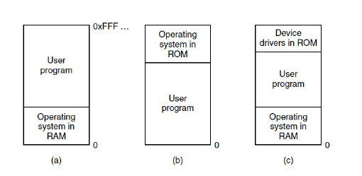

## Múltiples programas sin abstracción de memoria

Alternativa: Reubicación estática
: Sumar el registro de comienzo a la dirección de programas.

# Con abstracción de memoria

- Espacio de direcciones `Conjunto de direcciones que puede utilizar un proceso para direccionar la memoria` `Cada proceso tiene su propio espacio de direcciones, a menos que deseen compartilo`.
- Registro base y límite.
  - Versión simple de la **reubicación dinámica**.
  - **Base:** Dirección física donde comienza el espacio de direcciones del proceso.
  - **Límite:** Tamaño del espacio de direcciones.
  - _Desventaja:_ Necesidad de realizar sumas (acarreo) y comparaciones.

## Intercambio

Estrategia para lidiar con la sobrecarga de memoria basada en llevar cada proceso completo a memoria, ejecutarlo durante cierto tiempo y luego regresarlo al disco.

## Memoria virtual

Estrategia para lidiar con la sobrecarga de memoria que permite que los programas se ejecuten incluso cuando sólo se encuentran en forma parcial en la memoria.

## Compactación de memoria

Técnica que combina todos los huecos de memoria contiguos en un solo hueco más grande. No se usa en la práctica.

# Administración de memoria libre

## Administración de memoria con mapas de bits

Memoria se divide en unidades de asignación tan pequeñas como unas cuantas palabras y tan grandes como varios kilobytes. Cada unidad de asignación tiene un bit asociado que indica si la unidad está libre o no.

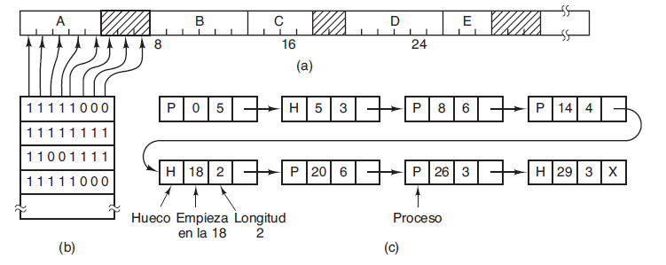

## Administración de memoria con listas enlazadas

Lista enlazada de segmentos de memoria asignados y libres. Cada segmento contiene un proceso o es un hueco vacío entre dos procesos.

### Algoritmos

- Primer ajuste (desde el principio)
- Siguiente ajuste (continua del punto anterior)
- Mejor ajuste (hueco que mejor se ajusta)
- Peor ajuste (el hueco más grande posible)

> Alternativa: Tener dos listas separadas. Una para huecos y otra para procesos.

# Memoria virtual

- Agrandamiento del software (bloatware).
- Programas más grandes que la memoria.
- Overlays (sobrepuestos): Partes de un programa que se cargan y descargan según sea necesario.
- Memoria virtual: Dividir en trozos llamados páginas. No todas las páginas de un programa deben estar en memoria al mismo tiempo.
  - Referencias a memoria traducidas dinámicamente.
  - Un proceso puede cargarse y descargarse de tal forma que ocupe regiones diferentes.
  - No es necesario que estas páginas sean contiguas en memoria.
  - **Conjunto residente:** Páginas que están en memoria.
  - Si una dirección lógica no está en memoria, se produce un **fallo de página**. Bloquea al proceso.
  - Se pueden mantener más procesos en memoria principal.
  - Es posible que un proceso sea más grande que la memoria principal.
  - **Hiperpaginación:** El sistema operativo expulsa una página que se necesita inmediatamente.

## Paginación

MMU (Memory Management Unit): Traduce direcciones lógicas a físicas.

## Tablas de páginas

Asociar páginas virtuales a los marcos de páginas físicas.

### Entrada en la tabla de páginas

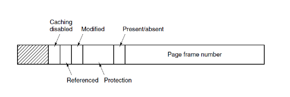

### Aceleración de la paginación

1. La asociación de una dirección virtual a una dirección física debe ser rápida.
2. Si el espacio de direcciones virtuales es grande, la tabla de páginas será grande.

### TLB (Translation Lookaside Buffer - Búfer de traducción adelantada)

Pequeño dispositivo de hardware que asocia direcciones virtuales a direcciones físicas sin pasar por la tabla de páginas.

### Tablas de páginas para memorias extensas

- Tablas de páginas multinivel.
- Tablas de páginas invertidas.

### Algoritmos de reemplazo de páginas

- Óptimo

  - Eliminar la página que no se referencia por mucho tiempo.
  - No se puede implementar en la práctica porque no se puede conocer a priori cuándo se va a referenciar.

- NRU (No Usadas Recientemente) `Orden de prioridad de reemplazo`
  - Clase 0: No referenciadas, no modificadas.
  - Clase 1: No referenciadas, modificadas.
  - Clase 2: Referenciadas, no modificadas.
  - Clase 3: Referenciadas, modificadas.
- Segunda Oportunidad
  - Se elimina la página más vieja que no ha sido referenciada. Variación de FIFO.
- Reloj

  - Variación de Segunda Oportunidad.
  - Cuando ocurre un fallo de página, se inspecciona la página a la que apunta la manecilla. Si el bit R (referenciado) es 0, se elimina. Si es 1, se pone en 0 y se sigue avanzando.
  - 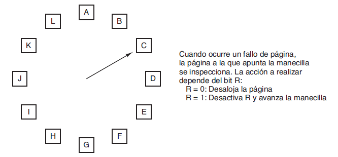

- LRU (Menos Utilizadas Recientemente)

  - Descartar la página que menos se utiliza en el tiempo.
  - Contador de referencia a la página. Se elimina la menor.

- 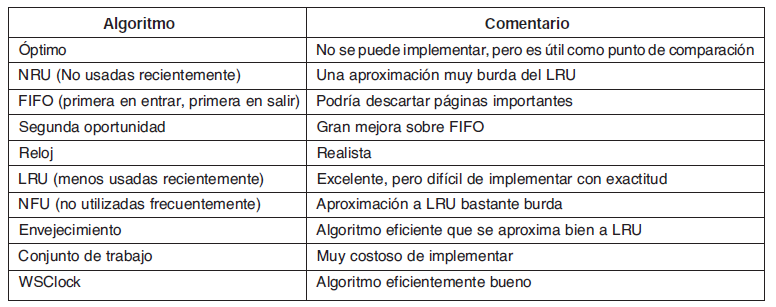

## Cuestiones de diseño para los sistemas de paginación

- Política de Asignación Local vs Global
  - Local: Al obtener un fallo de página, se intercambia una página del proceso que lo causó.
  - Global: Se intercambia una página de cualquier proceso.
- Proporción de fallos de página como una función de marcos de página de asignación.
  - La proporción de fallos disminuye a medida que se asignan más marcos de página.
- Control de carga
  - Sobrepaginación: Continuos fallos de página.
    - Alternativa: Intercambiar procesos enviándolos al disco y liberando marcos de página.
  - Grado de multiprogramación: Número de procesos en memoria.
    - Si es muy alto, se produce sobrepaginación.
    - Si es muy bajo, la CPU no se utiliza eficientemente.
- Tamaño de página
  - No hay un tamaño de página óptimo.
  - Páginas pequeñas: Fragmentación interna. Programas necesitan más páginas = Tablas de páginas más grandes.
  - Páginas grandes: Mayor parte de la página no se utiliza.
- Páginas compartidas (más de una instancia del programa)
  - ?
- Bibliotecas compartidas
  - "Bibliotecas de enlace dinámico" (DLLs) en Windows.
  - Bibliotecas que se cargan en memoria una vez y se comparten entre procesos.
  - ?
- Archivos compartidos
  - Incluyen a las bibliotecas compartidas.
  - ?
- Política de limpieza (demonio de paginación)
  - Proceso en segundo plano que se encarga de limpiar la memoria.
- Interfaz de memoria virtual (el programador podría llegar a tener cierto grado de control)
  - Se le otorga control para permitir que dos o más procesos compartan memoria.

## Segmentación

- No es necesario que todos los segmentos de todos los programas tengan la misma longitud.
- Existe una longitud máxima para cada segmento.
- Una dirección lógica segmentada consta de dos partes, un número de segmento y un desplazamiento.
- La segmentación es similar a la partición dinámica como consecuencia del empleo de segmentos de diferentes tamaños.

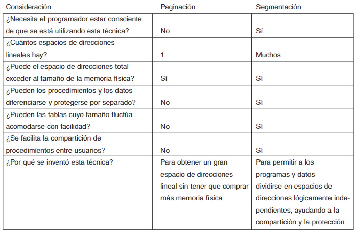

# Sistema de archivo

## Archivo
Unidades lógicas de información creada por los procesos. Estructuran, denominan, abren, utilizan, protegen, implementan y administran.

La parte del sistema operativo que trata con ellos es el **sistema de archivos**.

## Problemáticas
- Espacio de direcciones limitado
- Persistencia (que la información no sea volátil)
- Concurrencia (que varios procesos accedan a partes de la información al mismo tiempo)

> 1. Debe ser posible almacenar una cantidad muy grande de información.
> 2. La información debe sobrevivir a la terminación del proceso que la utilice.
> 3. Múltiples procesos deben ser capaces de acceder a la información concurrentemente.

## Punto de vista del usuario acerca del sistema de archivos
> El aspecto más importante es la apariencia: qué constituye un archivo, cómo se denominan y protegen los archivos, qué operaciones se permiten entre ellos, etc.

### Nomenclatura
Muchos sistemas de archivos admiten nombres de hasta 255 caracteres.

UNIX
: Case sensitive. Diferente archivo.

MS-DOS (Windows)
: Case insensitive. Es el mismo archivo.

Extensiones (.pdf)
- MS-DOS: Nombre [1-8 caracteres], Extensión (opcional) [1-3 caracteres]

- UNIX: Tamaño de extensión **libre**. Un archivo puede tener 2 o más extensiones.

### Estructura
1. Secuencia de bytes sin estructura. Mayor flexibilidad. Al sistema operativo no le interesa que hay dentro del archivo. Metodología utilizada por UNIX y Windows.

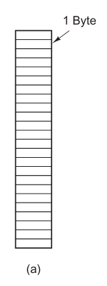

1. Secuencia de registros. Cada archivo es una secuencia de registros de longitud fija. Cada registro tiene una estructura interna. Buscaba que la operación de lectura devuelva un registro y la operación de escritura sobreescriba o agregue un registro.

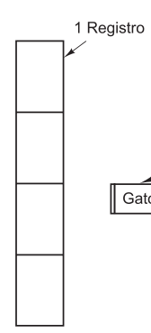

1. Árbol de registros. No necesariamente todos tienen la misma longitud. Cada registro tiene un campo **llave**. Se ordena en base al campo **llave**. Utilizado en computadoras mainframe.

### Tipos de archivos
- Regulares: Contienen información del usuario. ASCII o Binario.
- Directorios: Sistemas de archivos que mantienen la estructura del sistema de archivo.
- Archivos especiales de caracteres: Modelan dispositivos de E/S.
- Archivos especiales de bloque: Modelan discos.

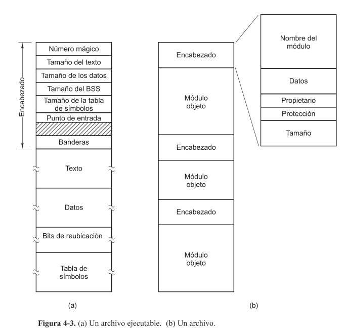

**Número mágico:** Identifica al archivo como ejecutable.

### Acceso a archivos
- **Secuencial:** Proceso puede leer todos los bytes o registros de un archivo en orden, empezando desde el principio. No puede saltear algunos o leerlos en un orden diferente. Se puede rebobinar. Convenientes en cintas magnéticas.	

- **Aleatorio:** Se pueden leer los bytes o registros de un archivo fuera de orden. Accede a través de llaves y no de posiciones. Requerido por muchas aplicaciones. 

### Atributos de archivos (o metadatos)
> Protección, contraseña, owner, fechas, tamaño, etc.

### Directorios
- Sistemas de directorios de un solo nivel
  - Directorio que contenga a todos los otros (directorio raíz).
  - Simple y localiza rápidamente los archivos.
  - 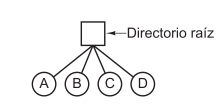
- Sistemas de directorios jerárquicos
  - Subdirectorios que permiten organizar los archivos. Casi todos los sistemas de archivos modernos utilizan esta estructura.
  - 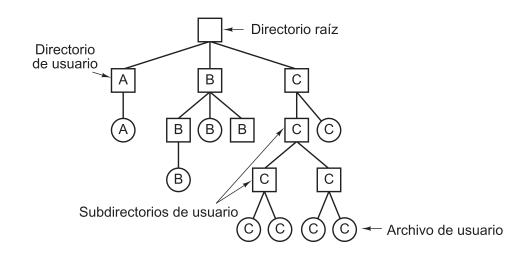

## Punto de vista del sistema operativo acerca del sistema de archivos
> Implementación, listas enlazadas, mapa de bits, etc.