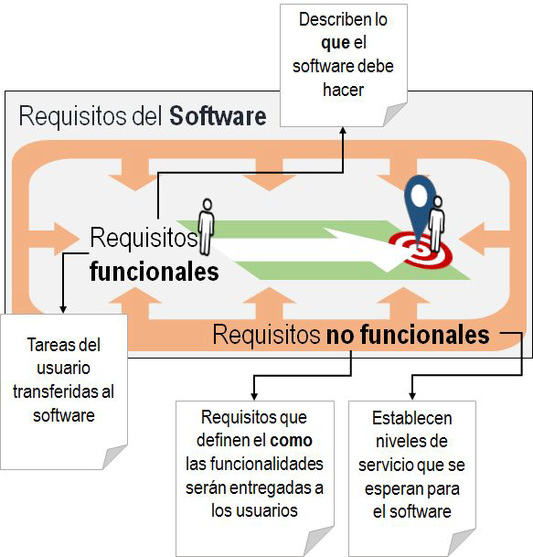

# Requisito

Una condición o capacidad que debe poseer un sistema, producto, servicio o componente resultante para satisfacer un contrato, norma, especificación u otro documento formalmente impuesto. Los requisitos incluyen las necesidades cuantificadas y documentadas, deseos y expectativas del patrocinador, clientes y otros interesados
"La calidad es la adecuación para el uso"

Requisitos (o necesidades) de negocio son declaraciones de más alto nivel
de objetivos, metas o necesidades de la organización. Ellos describen las
razones por las cuales se inició un proyecto, los objetivos que debe alcanzar
y las métricas que se utilizarán para medir su éxito.

## Necesidades

- Una condición o capacidad necesaria del usuario con el fin resolver
un problema o alcanzar un objetivo (ISO/IEC/IEEE, 2010).
- Condición o capacidad que debe ser atendida o poseída por un
sistema o componente de un sistema para satisfacer un contrato,
estándar, especificación u otro documento formalmente imposto
(ISO/IEC/IEEE, 2010).

## Especificación de Requisitos

La especificación de requisitos es un contrato entre el cliente y el equipo de
desarrollo. Este documento debe explicar a los clientes lo qué será
entregado, producto del trabajo del equipo de desarrollo.

Los clientes deberían proporcionar feedback antes de que algun trabajo equivocado se produsca en fases más adelantadas del proyecto

El nivel de detalle pude variar y depende de ciertos aspectos en el ambito del proyecto

por ejemplo el conocimiento previo sobre el caso practico, anteriores proyectos, como es la comunicacion con el cliente, cambios en el personal, etc.

Una regla de negocio es un requisito

En pocas palabras, los requisitos funcionales describen el funcionamiento del software, teniendo en cuenta la perspectiva de las tareas y servicios de sus usuarios.
Los requisitos no funcionales describen cualidades que el producto de software debe observar para ser efectivo y limitaciones generales sobre el funcionamiento de los requisitos funcionales para el software.

## Requisitos funcionales

Los requisitos funcionales describen el comportamiento que el software debe tener en términos de tareas y servicios de los usuario.

Un requisito funcional no es y no sustituye una
especificación de requisitos. Se debe destacar que los requisitos funcionales
no describen el diseño de la arquitectura de la solución, pero están
profundamente afectados por ella.

El comportamiento esperado por el software y descrito en un requisito
funcional, se refiere al intercambio de información entre el usuario, el
software y los medios de almacenamiento hasta que un objetivo específico
sea alcanzado. Este objetivo específico - la meta de un usuario - es
completar la tarea bajo su responsabilidad

## Requisitos no funcionales

los requisitos no funcionales que describen las limitaciones de orden general a los requisitos funcionales, y con esto complementan la especificación del software.

los requisitos no funcionales terminan por establecer niveles de servicio esperados para el funcionamiento del software.